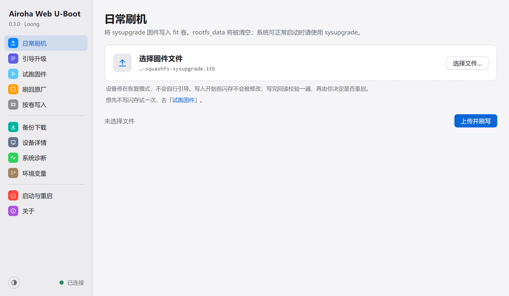
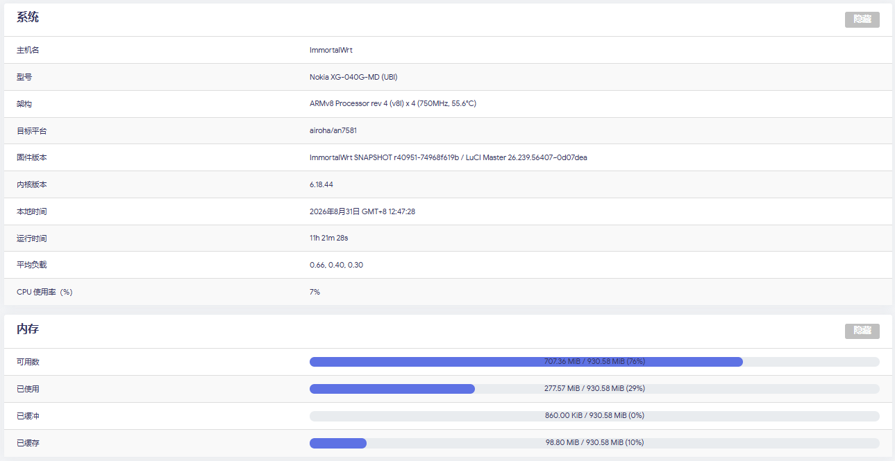

[中文](README.md)

ImmortalWrt for Airoha-based fiber ONTs, with a web U-Boot that flashes and recovers in a browser.

**[Downloads](https://github.com/Loong1996/ImmortalWrt-Airoha/releases)** · **[Web U-Boot guide](https://loong1996.github.io/ImmortalWrt-Airoha/recovery-guide.html)** · **[Tools](https://loong1996.github.io/ImmortalWrt-Airoha/)** (package picker / guides) · QQ group **1092754041**

☕ Spare-time project, open source, no charge. If it helps, **star the repo**, or buy the author a coffee:

## Supported models

Nokia XG-040G-MD, Nokia XG-040G-MF, Nokia XG-140G-MD, Nokia XG-140G-MF, Nokia XG-040G-TF, ZNXT ZN504XG-D, ZNXT ZN515XG-D, FiberHome HG5382A (not yet verified on hardware)

## Before you flash

> [!WARNING]
> **Keep a USB-TTL serial adapter ready, in case you need to recover.** Back up the whole flash first. `ri` (MAC, serial number) and `bosa` (optical calibration) are unique to each unit. Lose them and there is nowhere to get them back.

- [Get the stock super password](https://www.right.com.cn/FORUM/thread-8440823-1-1.html)
- [Teardown, flashing, setup, and stock partition backup](https://www.right.com.cn/forum/thread-8467912-1-1.html)
- [Stock backup and restoring stock firmware](docs/backup-and-restore.md)

## Which variant

Two partition layouts. The release title names the one you got, for example `XG-040G-MD-ubi-auto-20260906-58`.

| Variant | Bootloader | rootfs | Back to stock |
| --- | --- | --- | --- |
| **`ubi` (recommended)** | Web U-Boot: flash and recover in a browser | **255.875 MB** | With a full backup, write the whole flash back from the web page |
| `stock` | Stock bootloader, left as is | 129 MB | Yes |

Partition map and flash method: [Device variants](docs/variants.md).

## Flashing (`ubi`)

| Situation | What to do |
| --- | --- |
| First flash | Attach serial once and send the two boot files. After that, everything is in the browser: [guide, chapter 2](https://loong1996.github.io/ImmortalWrt-Airoha/recovery-guide.html#serial) |
| System is up, and you want to upgrade | `sysupgrade` from the running system, keeping the config |
| Bricked, or it will not boot | Power on, wait 1–2 seconds, then hold reset. When the panel lights chase, the recovery page is up. Reflash in the browser: [guide, chapter 3](https://loong1996.github.io/ImmortalWrt-Airoha/recovery-guide.html#enter) |
| Back to stock | On the recovery page, "Restore stock" writes the full backup back: [guide 3.6](https://loong1996.github.io/ImmortalWrt-Airoha/recovery-guide.html#restore) |

## Build it yourself

This repo holds the build configs, bundled packages, web pages, and CI. Firmware source is the `master-airoha` branch of [Loong1996/immortalwrt](https://github.com/Loong1996/immortalwrt) (immortalwrt `master`, kernel 6.18). Device support and the U-Boot patches live in that tree.

1. Fork this repo and enable Actions.
2. `Actions → ImmortalWrt-Airoha → Run workflow`. The model defaults to `all` (every model in parallel). A single model is `xg-040g-md` / `xg-040g-mf` / `xg-040g-tf` / `zn504xg-d` / `hg5382a`. Then pick a variant. Memory size defaults to [auto](docs/variants.md#内存容量). Leave it.
3. Firmware is ready in about 1–2 hours. Where it goes depends on the publish mode:
   - `auto` (default): a `master-airoha` build on `main` is published to this repo's Releases. Other branches upload an Artifact only.
   - `prerelease`: a Release marked pre-release. It does not replace Latest, and it does not show up in the guide's download list.
   - `artifact`: Artifact only, for a custom build. Download it from the bottom of that run (GitHub login required). Kept for 30 days.

A spare Linux machine can build with `./build.sh`. The arguments match `Run workflow`. See [Local build](docs/local-build.md).

## Docs

The pages below are in Chinese.

**Using it**

| Doc | What it covers |
| --- | --- |
| [Web U-Boot recovery](docs/uboot-http-recovery.md) | Page layout, first migration, LED patterns, patch list |
| [Device variants](docs/variants.md) | `ubi` and `stock` layouts, boot differences, auto memory size |
| [Custom packages](docs/packages.md) | What is built in, how the package picker works, what you can add after flashing |
| [LED behavior](docs/leds.md) | Panel and port LEDs, and how to change them |
| [Stock backup and restore](docs/backup-and-restore.md) | Stock partition map, full-flash backup, ways back to stock |
| [Known issue: the USB2 port cannot drive a USB3 stick](docs/usb2-port-issue.md) | Ruled-out hypotheses, register data, where to pick up next |
| [Known issue: software reboot sticks at Press x after a serial migration](docs/warm-reset-press-x.md) | Strap latched at power-on, measurements, routes already tried, what is left |
| [Known issue: the 2.5G port sometimes receives nothing](docs/lan1-en8811h-boot-race.md) | A reboot clears it; live counters, ruled-out directions, repro matrix |

**Development**

| Doc | What it covers |
| --- | --- |
| [Local build](docs/local-build.md) | Machine requirements, full steps, incremental rebuild, fetching the output |
| [Branches and following upstream](docs/branches.md) | One line is maintained; the rebase flow |
| [Following upstream: drift check](docs/upstream-drift.md) | Upstream changes a rebase does not show |
| [master-airoha migration notes](docs/master-airoha-migration.md) | How this line was put together. Historical |

## Credits

- The build script started from [dalutou/OpenWrt-for-XG-040G-MD](https://github.com/dalutou/OpenWrt-for-XG-040G-MD). The 25.12 line came from a tested snapshot by [fzs209](https://github.com/fzs209). Both have been rewritten heavily since.
- The predecessor is [ImmortalWrt-XG-040G-MD](https://github.com/Loong1996/ImmortalWrt-XG-040G-MD). Full history, the 25.12 line, and the tcboot variant stay there and are no longer updated. This repo starts from one commit. The license is still MIT, and the original copyright notices stay.
- Firmware source [Loong1996/immortalwrt](https://github.com/Loong1996/immortalwrt) is a fork of upstream [immortalwrt/immortalwrt](https://github.com/immortalwrt/immortalwrt). Device support sits on upstream master.
- Flash: upstream kernel 6.18 supports SkyHigh S35ML02G300 and Fudan Micro FM25G01B / FM25G02B. Official UBI U-Boot (2026.07) ships SkyHigh only. Patches `120` and `121` for the Fudan parts are in the source tree.
- The NPU firmware load error (`Direct firmware load for airoha/en7581_npu_rv32.bin failed with error -2`) is fixed following [this write-up](https://github.com/xiangtailiang/OpenWrt-for-XG-040G-MD/blob/main/docs/npu-firmware-load.md).
